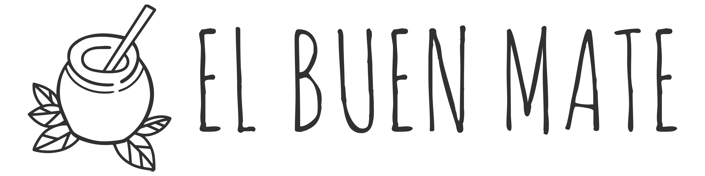

# Guevara-ElBuenMate

## Tipo de e-commerce
### Venta de productos relacionados al mate (mates, bombillas, termos, yerba)

## Historia de la página
### Somos un emprendimiento familiar nacido en Córdoba, en el cuál decidimos dar un paso más con algo que es común en toda la familia, el mate.
### En nuestro sitios encontraran diferentes modelos de mates, termos, bombillas y yerba mate de diferente variedades y marcas, para todos los gustos. 

## Público Objetivo
### El público de nuestro e-commerce va desde los 15 hasta los 60 años.

## Tipografía principal
### Amatic SC
## Tipografía secundaria
### Roboto

## Paleta de colores
### #ffffff
### #313131
### #6F9B4F

## Logo

## FIGMA
https://www.figma.com/file/Yh6gnhYkV5ZpAv5Jhg5U3i/Sprint-2---Bocetado-de-Wireframe?node-id=0%3A1
